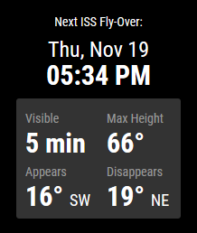

# Magic Mirror Module: ISS Fly-Overs

This modules for the [Magic Mirror²](https://github.com/MichMich/MagicMirror) will show a card when there's an ISS flyover with a good possibility of viewing.



**This is v1.0** -- and, as the module does what I want, won't likely change much. 

## Why?
Why another ISS module when mykle1 [has already created one](https://github.com/mykle1/MMM-ISS) that works fine?  Well, personal preference.  I didn't like the NASA
widget look compared to the aesthetics of the rest of my mirror.  Plus, the APIs mykle1 is using (or rather, [the APIs that the APIs are using](https://github.com/open-notify/Open-Notify-API)) are slated to be shut down (see the first output line of [the old spaceflight](https://spaceflight.nasa.gov/realdata/sightings/SSapplications/Post/JavaSSOP/orbit/ISS/SVPOST.html) page).

So, here we are.

## How?
### Manual install

1. Clone this repository in your `modules` folder, and install dependencies:
  ```bash
  cd ~/MagicMirror/modules # adapt directory if you are using a different one
  git clone https://github.com/daterrell/MMM-ISS.git
  cd MMM-ISS
  npm install
  ```
2. Add the module to your `config/config.js` file.
  ```js
  {
    module: 'MMM-ISS',
    position: 'bottom_center',
    config: {
      // These values must come from available locations on the SpotTheStation site: https://spotthestation.nasa.gov/
      country: "United States",
      region: "Massachusetts",
      city: "Boston"
    }
  },
  ```